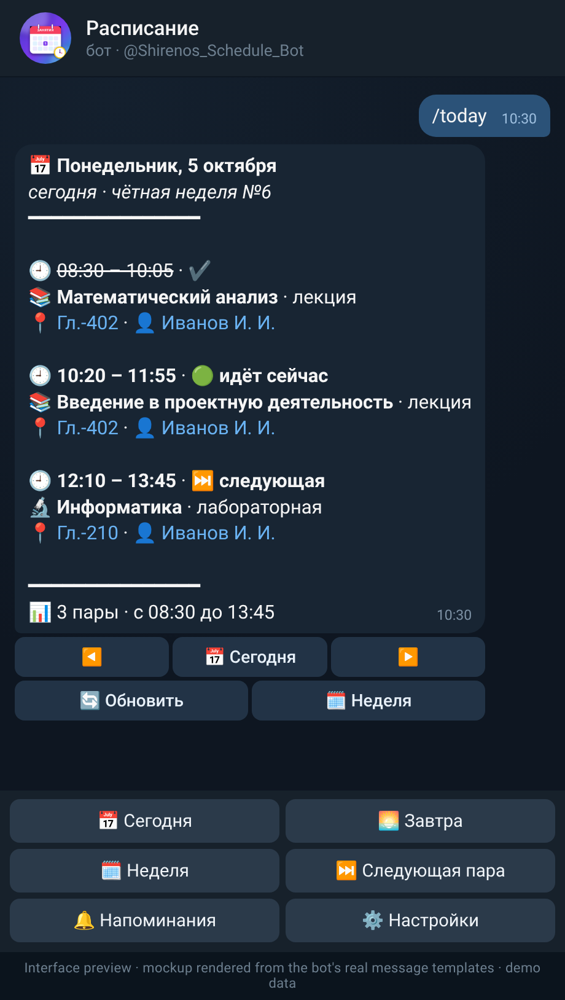
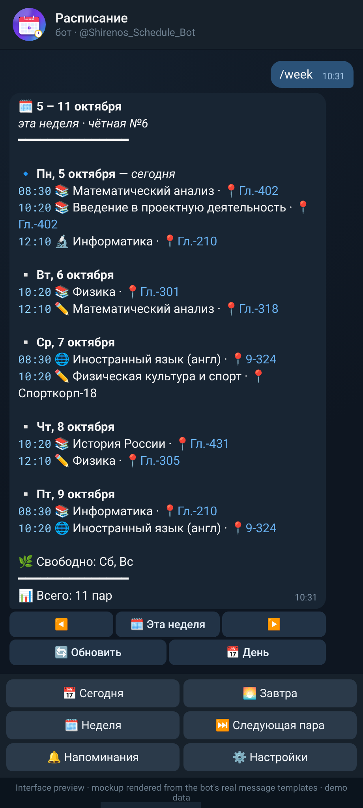

# 🎓 University Schedule Bot

A Telegram bot that keeps your university class schedule at hand: today, tomorrow, the whole
week, the next class, odd/even week handling and reminders before each lecture.
Built with **aiogram 3**, **SQLite (aiosqlite)** and a small dependency-free **asyncio scheduler**.
The bot's user interface is in Russian (message strings and the example output below are shown
as the bot really sends them; English glosses are added in parentheses where useful).

[](https://github.com/Shirenos/university-schedule-bot/actions/workflows/ci.yml)


[](https://docs.astral.sh/ruff/)
[](LICENSE)
[](https://github.com/Shirenos/university-schedule-bot)

<p align="center">
  
  &nbsp;&nbsp;
  
</p>

<p align="center"><sub><b>Interface preview</b> (mockup rendered from the bot's real message templates) —
<code>/today</code> and <code>/week</code> with an invented demo timetable (public course titles; the
teacher name is a placeholder). These are <b>not</b> real screenshots of a Telegram chat; regenerate
them with <code>python scripts/make_previews.py</code>.</sub></p>

**Try it:** [@Shirenos_Schedule_Bot](https://t.me/Shirenos_Schedule_Bot) on Telegram. The bot runs on
the owner's own machine, so it may be offline.

<details>
<summary><b>🇷🇺 Русская версия</b></summary>

### 🎓 University Schedule Bot — бот с расписанием занятий

Telegram-бот, который держит расписание пар под рукой: сегодня, завтра, вся неделя, ближайшая пара,
чётные/нечётные недели и напоминания перед каждой парой. Интерфейс на русском. Построен на
**aiogram 3**, **SQLite (aiosqlite)** и небольшом планировщике на `asyncio`.

> Картинки выше — это **макет интерфейса** (отрисован локально из настоящих шаблонов сообщений бота
> на выдуманных демо-данных), а не реальные скриншоты чата.

**Попробовать:** [@Shirenos_Schedule_Bot](https://t.me/Shirenos_Schedule_Bot). Бот работает на
личном компьютере владельца, поэтому может быть офлайн.

**Возможности**

- У каждого пользователя своё изолированное расписание.
- Аккуратные карточки пар: тип занятия, время `09:00 – 10:30`, 📍 аудитория (ссылка на корпус на
  карте), 👤 преподаватель, пометки «идёт сейчас» и «следующая», номер и чётность недели.
- Меню и кнопки ◀️ ▶️ для перехода по дням и неделям, обновление сообщения «на месте».
- Синхронизация с сайтом ТулГУ: `/tulgu <группа>` загружает расписание группы с
  [tulsu.ru/schedule](https://tulsu.ru/schedule/), `/sync` обновляет, `/filters` выбирает подгруппу
  (например, французский/немецкий).
- Быстрые команды: `/today`, `/tomorrow`, `/week`, `/next` (с обратным отсчётом), `/week_parity`.
- Свои пары: пошаговый диалог `/add`, импорт из CSV `/import`, список `/list`, удаление `/delete`.
- Напоминания `/remind` за N минут до пары; планировщик восстанавливается после перезапуска.
- Часовой пояс и дата начала семестра настраиваются (`TIMEZONE`, `SEMESTER_START`).

**Быстрый старт**

```bash
# 1. создайте бота у @BotFather и скопируйте токен
cp .env.example .env     # впишите BOT_TOKEN, TIMEZONE и SEMESTER_START (например, 2026-08-31)

# 2a. запуск локально
python -m venv .venv && source .venv/bin/activate
pip install -r requirements.txt -e .
python -m schedule_bot

# 2б. или через Docker
docker compose up -d --build
```

Затем в чате с ботом: `/tulgu <номер группы>` — и `/today`. Токен хранится только в `.env` (файл в
`.gitignore`) и никогда не попадает в репозиторий. Проверки:
`pip install -r requirements-dev.txt -e . && ruff check . && pytest`.

</details>

## ✨ Features

- **Personal schedules** — every Telegram user has their own isolated timetable.
- **Pretty messages** — HTML cards with emoji per lesson type (📚 lecture, ✏️ practice, 🔬 lab,
  🌐 languages), times as `09:00 – 10:30`, 📍 room (a link to its building on the map), 👤 teacher (a link to their timetable on tulsu.ru), Russian date headers
  («Понедельник, 5 октября» — “Monday, 5 October”), week parity and number, 🟢 *«идёт сейчас»*
  (“in progress”) / ⏭ *«следующая»* (“next”) markers and a
  friendly empty-day message. All user text is HTML-escaped.
- **Menu & navigation** — a persistent reply keyboard (Сегодня · Завтра · Неделя · Следующая пара ·
  Напоминания · Настройки — Today · Tomorrow · Week · Next class · Reminders · Settings), ◀️ ▶️ day/week buttons that edit the message in place, 🔄 refresh, an inline
  settings panel and a reminder panel with presets.
- **TulSU sync** — `/tulgu <group>` downloads your group's timetable from the public JSON endpoints
  of [tulsu.ru/schedule](https://tulsu.ru/schedule/) (Tula State University) and keeps real, dated
  lessons per user. `/sync` refreshes it; parallel subgroups (French / German / English) can be
  filtered with `/filters`.
- **Quick views** — `/today`, `/tomorrow`, `/week` (current week) and `/next` (next class with a countdown).
- **Odd/even weeks** — classes can run every week, on odd weeks only or on even weeks only;
  `/week_parity` shows which kind of week it is. The semester start date is configurable.
- **Guided `/add` dialog** — an aiogram FSM walks you through weekday → time → subject → type
  (lecture / seminar / lab) → room → teacher → week parity, with inline keyboards and validation.
- **CSV import** — `/import` accepts a CSV file; bad rows are reported, good rows are imported.
  Understands `,` and `;` delimiters, UTF-8 and Windows-1251, Russian and English values.
- **Reminders** — `/remind on|off|<minutes>` sends a message N minutes (default 15) before every
  class. The asyncio scheduler is restored from SQLite on startup, so nothing is lost on restart.
- **Timezone aware** — "today", "next class" and reminders follow the configured IANA timezone.
- **Safe output** — user input is HTML-escaped; limits on field length, file size and lessons per user.
- **Production ready** — Dockerfile, docker-compose with a persistent volume, CI with ruff + pytest
  on Python 3.11 / 3.12 / 3.13.

## 💬 Commands

| Command | Description |
| --- | --- |
| `/start`, `/help` | Greeting with the main menu, and the command reference |
| `/menu` | Show the bottom menu keyboard again |
| `/settings` | Settings panel: sync, group, subgroups, reminders, add class, parity |
| `/today`, `/tomorrow` | Classes for today / tomorrow (respects week parity) |
| `/week` | Schedule of the current week |
| `/next` | The next class and how long until it starts |
| `/tulgu <group>` | Load the timetable of a TulSU group from tulsu.ru (without arguments: show the saved group) |
| `/sync` | Refresh the TulSU timetable |
| `/filters` | Choose which parallel subgroup to follow (e.g. `фр` / `нем` / `англ` = French / German / English) |
| `/add` | Add a class step by step (`/cancel` aborts any dialog) |
| `/list` | Entire weekly timetable with class ids |
| `/delete <id>` | Delete a class by its id from `/list` |
| `/import` | Upload a CSV file with the schedule |
| `/remind` | Reminder panel with buttons (on/off, 5 / 10 / 15 / 30 / 60 min) |
| `/remind on` / `off` / `<minutes>` | Enable or disable reminders, or set the lead time, e.g. `/remind 30` |
| `/week_parity` | Is the current week odd or even? |

## 📄 CSV format

```csv
weekday,start,end,subject,type,room,teacher,parity
mon,09:00,10:30,Математический анализ,lecture,А-101,Иванов И. И.,every
mon,12:40,14:10,Физика,lecture,Б-301,Петрова А. С.,odd
```

| Column | Accepted values |
| --- | --- |
| `weekday` | `1`–`7` (Mon = 1), `mon`…`sun`, `пн`…`вс`, full Russian/English names |
| `start`, `end` | `HH:MM`; `end` must be later than `start` |
| `subject` | any text (required) |
| `type` | `lecture` / `seminar` / `lab` (also `лекция` / `семинар` / `лаб`) |
| `room`, `teacher` | optional |
| `parity` | `every` / `odd` / `even` (also `нечётная` / `чётная`); empty means `every` |

(For a real university timetable use [`/tulgu`](#-tulsu-timetable-sync) instead.)

A ready-to-use sample lives in [`examples/schedule.csv`](examples/schedule.csv). Imported classes
are appended to the existing schedule.

## 🎨 Interface

The bottom keyboard gives one-tap access to the everyday views; `/today` and `/tomorrow` carry
◀️ ▶️ buttons to browse days and 🔄 to refresh, `/week` browses weeks. A text rendition of the
output for the public timetable of group 221461 on Monday 5 October 2026, 09:50 (teacher names
replaced by a placeholder; the real bot sends the same content as formatted Telegram HTML, where
📍 room and 👤 teacher are clickable links):

```text
📅 Понедельник, 5 октября
сегодня · чётная неделя №6
━━━━━━━━━━━━━━━

🕘 07:45 – 09:20 · ✔️
📚 Культура речи и нормы делового взаимодействия · лекция
📍 Гл.-402 · 👤 Иванов И. И.

🕘 09:40 – 11:15 · 🟢 идёт сейчас
📚 Введение в проектную деятельность · лекция
📍 Гл.-402 · 👤 Иванов И. И.

━━━━━━━━━━━━━━━
📊 2 пары · с 07:45 до 11:15
        [ ◀️ ]  [ 📅 Сегодня ]  [ ▶️ ]
        [ 🔄 Обновить ]  [ 🗓 Неделя ]
```

```text
🗓 5 – 11 октября
эта неделя · чётная №6
━━━━━━━━━━━━━━━

🔹 Пн, 5 октября — сегодня
07:45 📚 Культура речи и нормы делового взаимодействия · 📍Гл.-402
09:40 📚 Введение в проектную деятельность · 📍Гл.-402

▫️ Ср, 7 октября
07:45 🌐 Иностранный язык (фр) · 📍9-324
09:40 ✏️ Физическая культура и спорт · 📍Спорткорп-18
…
🌿 Свободно: Вс
━━━━━━━━━━━━━━━
📊 Всего: 17 пар
```

> **Reading the examples:** `Понедельник` = Monday, `сегодня` = today, `чётная неделя №6` = even
> week no. 6, `идёт сейчас` = in progress, `лекция` = lecture, `пары` = classes, `с … до …` = from …
> to …, `Свободно` = free, `Всего` = total, `Обновить` = refresh, `Неделя` = week, `Иностранный язык`
> = foreign language, `Физическая культура и спорт` = physical education.

### Clickable rooms and teachers

In lesson cards the room and the teacher are links (link previews are switched off for every
message the bot sends, so the chat stays compact). Nothing is guessed — only what tulsu.ru really
publishes is linked:

| Element | Link | When |
|---|---|---|
| 📍 `Гл.-402` | map search for the building's address, e.g. `https://yandex.ru/maps/?text=Тула, проспект Ленина, 92` | the part of the room before the first `-` (`Гл.`, `9`, `12`, `6лаб`, ...) is listed in the building config |
| 👤 `Иванов И. И.` | `https://tulsu.ru/schedule/?search=<ФИО>` — the university's own timetable of that teacher | only for lessons synced from tulsu.ru (the full name comes from the university data) |

tulsu.ru has no floor plans or room schemes, so the room link opens the *building* on the map, not
the room. The timetable JSON contains no teacher or building ids, hence the name/address based
links. Everything that cannot be linked stays plain escaped text: unknown or address-less
buildings (academic building No. 13, “УК №13” — its official page lists no address; `15`, `16`, `19`, `УПК 19`, `КБП`,
`Спорткорп`, `Дистанционно` (“remote”), hospital sites, ...), rooms without a `<building>-<room>` form, and
teachers of lessons added by hand (`/add`, `/import`).

The building → address mapping lives in
[`src/schedule_bot/data/tulgu_buildings.toml`](src/schedule_bot/data/tulgu_buildings.toml). To
support another building append a table (no code changes, the file is read at start):

```toml
[[building]]
prefixes = ["14"]                       # as written before "-" in room names
name = "Учебный корпус №14"
address = "Тула, улица Примерная, 1"    # what the map link searches for
page = "https://tulsu.ru/facilities/academic-building/20"
```

The map service can be changed with the `map_url` template at the top of the same file.

### Bot profile and avatar

`python -m schedule_bot.profile` applies the bot's public profile through the Bot API using the
token from `.env` (it is never printed): name, description, short description, the command list
(default scope, Russian descriptions) and the "commands" menu button. The command list and menu
button are also refreshed on every start. Telegram rate-limits `setMyName`, so run the profile
command only when the texts in [`profile.py`](src/schedule_bot/profile.py) change.

The Bot API cannot change a bot's photo. A ready avatar is in [`docs/avatar.png`](docs/avatar.png)
(1024×1024); upload it manually via [@BotFather](https://t.me/BotFather) → `/setuserpic`. It is
generated by `python scripts/make_avatar.py` (needs `pip install pillow`).

## 🏛 TulSU timetable sync

The university site [tulsu.ru/schedule](https://tulsu.ru/schedule/) is itself a small JavaScript app
on top of two public, unauthenticated JSON endpoints. The bot uses the same ones:

| Endpoint | Used for |
| --- | --- |
| `GET /schedule/queries/GetDates.php?search_value=<group>` | semester `MIN_DATE` / `MAX_DATE`; an empty answer means the group does not exist |
| `GET /schedule/queries/GetSchedule.php?search_field=GROUP_P&search_value=<group>` | the list of dated lessons (`DATE_Z`, `TIME_Z`, `DISCIP`, `KOW`, `AUD`, `PREP`, `CLASS`) |

```text
/tulgu 221461     # download and save the timetable of group 221461
/sync             # refresh it later (at most one download per group per 5 minutes)
/filters          # choose a parallel subgroup again
```

**How it behaves**

- **Dated lessons** are stored per user in the `dated_lessons` SQLite table (date, start, end,
  subject, kind, room, teacher, group). `/today`, `/tomorrow`, `/week` and `/next` show them for their
  real dates and merge them with manually added weekly lessons; a weekly lesson with the same time
  slot and subject as a synced one is treated as a duplicate and hidden.
- **Parallel subgroups.** The same slot can contain parallel entries that differ only by a
  parenthesised suffix of the lesson kind, e.g. `Практические занятия (фр)` and
  `Практические занятия (нем)`. After a sync the bot detects such groups and asks, with an inline
  keyboard, which variant to keep (all suffixes of that subject are offered, so a subgroup that never
  shares a slot, like `(англ)`, is included too). The choice is stored per user and applied when
  reading, so changing it with `/filters` needs no re-download. "Показывать все" disables filtering.
- **Reminders** (`/remind`) work for synced lessons too, including the chosen subgroup only, and
  are rescheduled after every sync or filter change.
- **Polite to the site.** A descriptive `User-Agent`
  (`university-schedule-bot/<version> (+https://github.com/Shirenos/university-schedule-bot; …)`),
  10 s timeouts, up to three attempts for transient errors (timeouts, connection errors, 5xx) and an
  in-memory 5-minute cache per group with a per-group lock, so concurrent requests share one download.
- **Safe failures.** If the site is down, returns garbage or does not know the group, you get a
  friendly Russian message and the previously stored timetable stays untouched.

> 💡 Set `SEMESTER_START` to the first day of the semester (e.g. `2026-08-31` for the autumn 2026
> semester of group 221461) so that `/week_parity` and the odd/even weekly lessons match the university.

## 🚀 Quickstart

1. Create a bot with [@BotFather](https://t.me/BotFather) and copy the token.
2. Configure the environment:

   ```bash
   cp .env.example .env
   # edit .env: set BOT_TOKEN, TIMEZONE and SEMESTER_START
   ```

### Run locally

```bash
python -m venv .venv && source .venv/bin/activate
pip install -r requirements.txt -e .
python -m schedule_bot          # or: schedule-bot
```

### Run with Docker

```bash
docker compose up -d --build
docker compose logs -f
```

The SQLite database lives in the `bot-data` volume, so data survives container rebuilds.

### Configuration

| Variable | Default | Description |
| --- | --- | --- |
| `BOT_TOKEN` | — (required) | Telegram bot token from @BotFather |
| `DATABASE_PATH` | `data/schedule.db` | SQLite file location |
| `TIMEZONE` | `Europe/Moscow` | IANA timezone for "today", "next class" and reminders |
| `SEMESTER_START` | most recent 1 September | First day of the semester, `YYYY-MM-DD` |
| `LOG_LEVEL` | `INFO` | Python logging level |

> 🔐 Never commit `.env` — it is already in `.gitignore`.

### How week parity works

Week 1 is the Monday–Sunday week that **contains** `SEMESTER_START`; it is an **odd** week.
Week 2 is even, week 3 odd, and so on. With `SEMESTER_START=2026-09-01` (a Tuesday) the week of
31 Aug – 6 Sep is odd, 7–13 Sep is even.

## 🧪 Development

```bash
pip install -r requirements-dev.txt -e .
ruff check . && ruff format --check .
pytest
```

Tests cover the parity logic, next-class search, CSV import, the database layer, reminder
computation and the scheduler (driven by a fake clock), configuration, formatting, the TulSU client
(`httpx.MockTransport` with a sample payload including parallel French/German subgroups: caching,
retries, errors), subgroup detection/filtering, the merge of dated and weekly lessons, and the
`/add`, `/import`, `/tulgu`, `/sync`, `/filters`, menu, navigation and reminder-panel dialogs
end-to-end through a real aiogram
`Dispatcher` with a fake Telegram session. CI runs the same checks on Python 3.11, 3.12 and 3.13.

## 🗂 Project structure

```
university-schedule-bot/
├── src/schedule_bot/
│   ├── config.py            # Settings from env / .env
│   ├── db.py                # aiosqlite repository + schema
│   ├── models.py            # Lesson / ReminderSettings dataclasses
│   ├── main.py              # Wiring: bot, dispatcher, scheduler
│   ├── data/tulgu_buildings.toml  # building prefixes -> addresses (map links)
│   ├── profile.py           # Bot API profile: name, descriptions, commands, menu button
│   ├── __main__.py          # `python -m schedule_bot`
│   ├── handlers/            # aiogram routers
│   │   ├── basic.py         #   /start /help /cancel
│   │   ├── view.py          #   /today /tomorrow /week /next /week_parity /list
│   │   ├── add.py           #   /add FSM dialog
│   │   ├── manage.py        #   /delete
│   │   ├── importer.py      #   /import
│   │   ├── menu.py          #   reply-keyboard buttons, /settings panel
│   │   ├── remind.py        #   /remind + inline panel
│   │   ├── tulgu.py         #   /tulgu /sync /filters
│   │   ├── keyboards.py     #   inline keyboards
│   │   └── texts.py         #   static Russian texts
│   └── services/            # pure, easily testable logic
│       ├── parity.py        #   odd/even week arithmetic
│       ├── schedule.py      #   lessons per day, next class
│       ├── parsing.py       #   weekday / time / type / parity parsers
│       ├── csv_import.py    #   CSV → lessons
│       ├── formatting.py    #   HTML message rendering (Russian)
│       ├── links.py         #   room -> map and teacher -> tulsu.ru links
│       ├── tulgu.py         #   tulsu.ru HTTP client (UA, timeouts, retries, cache)
│       ├── filters.py       #   parallel-subgroup detection and filtering
│       ├── sync.py          #   sync a user's group into SQLite
│       ├── timetable.py     #   load weekly + filtered dated lessons
│       └── reminders.py     #   next-reminder logic + asyncio scheduler
├── tests/                   # pytest + pytest-asyncio
├── examples/schedule.csv    # sample schedule for /import
├── scripts/make_avatar.py   # generates docs/avatar.png (Pillow)
├── scripts/make_previews.py # renders docs/preview-*.png (chat mockups, headless Chrome)
├── docs/                    # avatar.png, preview-*.png (interface mockups)
├── .github/workflows/       # CI: ruff + pytest on 3.11 / 3.12 / 3.13
├── Dockerfile
├── docker-compose.yml
└── pyproject.toml
```

### Design notes

- **Layers**: handlers only parse Telegram input and format replies; `services/` holds the logic and
  is almost entirely pure functions; `db.py` is the only module that speaks SQL.
- **Router order**: plain command handlers are registered before the FSM step handlers, so commands
  like `/today` or `/cancel` keep working in the middle of a dialog.
- **Scheduler**: one asyncio task per user sleeping until the next "class start − N minutes" moment
  in the configured timezone. Reminder settings and lessons live in SQLite; tasks are recreated at
  startup and rescheduled whenever the schedule or settings change. The clock and `sleep` are
  injectable, which makes the scheduler fully testable without real waiting.
- **Parity**: a class repeats every two weeks at most, so searching two weeks ahead always finds the
  next occurrence.

## 🗺 Roadmap

- [ ] Automatic periodic re-sync with a notification about timetable changes
- [ ] Other universities / timetable providers
- [ ] Edit an existing class (`/edit <id>`)
- [ ] Per-user timezone and semester start
- [ ] Export the schedule back to CSV / iCalendar (`/export`)
- [ ] Exams, deadlines and one-off (non-recurring) events
- [ ] Inline "snooze" button on reminders
- [ ] Shared group schedules (one schedule, many students)
- [ ] Webhook mode
- [ ] Localisation (English UI)

## 🤝 Contributing

Issues and PRs are welcome. Please run `ruff` and `pytest` before submitting.

## 📄 License

[MIT](LICENSE) © 2026 Shiren
